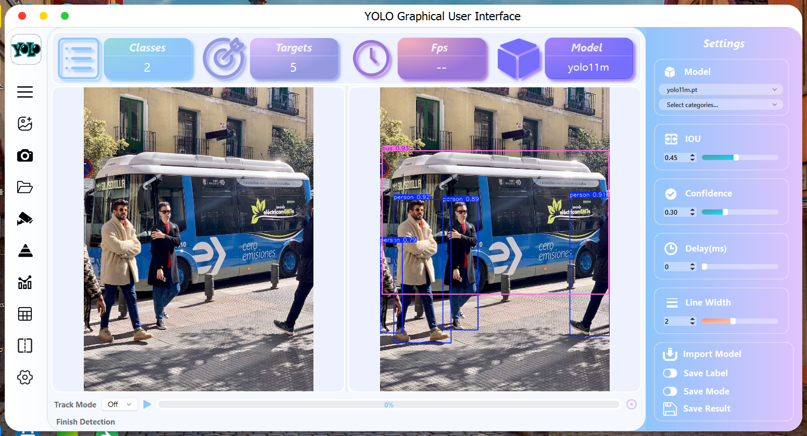

# YoloView - YOLOv5 / YOLOv8 / YOLOv9 / YOLOv10 / YOLOv11 / RTDETR / SAM / MobileSAM / GUI based on Pyside6

## Introduction

***YoloView*** is a user interface (GUI) application that supports Ultralytics-based `YOLOv5` `YOLOv8` `YOLOv9` `YOLOv10` `YOLOv11` `RT-DETR` `SAM` `MobileSAM` `FastSAM` models. 

 <p align="center"> 
  English &nbsp; | &nbsp; <a href="https://github.com/songminkyu/YOLOSHOW_New/blob/main/README_ko.md">한국어</a>
 </p>



## Todo List

- [x] Add `YOLOv8` `YOLOv9` `YOLOv10` `YOLO11` `RT-DETR`  `YOLOv11`  `SAM`  `MobileSAM`  `FastSAM` Model
- [x] Support Instance Segmentation （ `YOLOv5`  `YOLOv8`  `YOLOv11` `SAM`  `MobileSAM`  `FastSAM`）
- [x] Support Pose Estimation （ `YOLOv8`  `YOLOv11`）
- [x] Support Oriented Bounding Boxes ( `YOLOv8`  `YOLOv11` )
- [x] Support Http Protocol in `RTSP` Function ( `Single` Mode )
- [x] Add Model Comparison Mode（VS Mode）
- [x] Support Dragging File Input
- [x] `YOLO11` has additional features (obb,pose,deteced,segment,track)
- [x] Tracking & Counting ( `YOLOv8` & `YOLO11`)
- [x] Added bbox and segment category filter functions (under model selection function)
- [x] Added subfolder navigation feature (only when browsing folders)
- [x] Improved and enhanced statistics
- [x] Save Labal

## Functions

### 1. Support Image / Video / Webcam / Folder (Batch) / IPCam Object Detection

Choose Image / Video / Webcam / Folder (Batch) / IPCam in the menu bar on the left to detect objects.

### 2. Change Models / Hyper Parameters dynamically

When the program is running to detect targets, you can change models / hyper Parameters

1. Support changing model in YOLOv5 / YOLOv7 / YOLOv8 / YOLOv9 / YOLOv10 / YOLOv11 / RTDETR / YOLOv5-seg / YOLOv8-seg YOLOv11-seg / YOLOv8-pose / YOLOv11-pose / YOLOv8-obb / YOLOv11-obb / SAM / MobileSAM / FastSAM dynamically
2. Support changing `IOU` / `Confidence` / `Delay time ` / `line thickness` dynamically

### 3. Loading Model Automatically

Our program will automatically detect  `pt` files including [YOLOv5 Models](https://github.com/ultralytics/yolov5/releases) /  [YOLOv7 Models](https://github.com/WongKinYiu/yolov7/releases/)  /  [YOLOv8 Models](https://github.com/ultralytics/assets/releases/)  / [YOLOv9 Models](https://github.com/WongKinYiu/yolov9/releases/)  / [YOLOv10 Models](https://github.com/THU-MIG/yolov10/releases/)  that were previously added to the `ptfiles` folder.

If you need add the new `pt` file, please click `Import Model` button in `Settings` box to select your `pt` file. Then our program will put it into  `ptfiles` folder.

**Notice :** 

1. All `pt` files are named including `yolov5` / `yolov8` / `yolov9` / `yolov10` / `yolo11` / `rtdetr` / `sam` / `samv2` / `mobilesam` / `fastsam`.  (e.g. `yolov8-test.pt`)
2. If it is a `pt` file of  segmentation mode, please name it including `yolov5n-seg` / `yolov8s-seg` .  (e.g. `yolov8n-seg-test.pt`)
3. If it is a `pt` file of  pose estimation mode, please name it including `yolov8n-pose` .  (e.g. `yolov8n-pose-test.pt`)
4. If it is a `pt` file of  oriented bounding box mode, please name it including `yolov8n-obb` .  (e.g. `yolov8n-obb-test.pt`)

### 4. Loading Configures

1.  After startup, the program will automatically loading the last configure parameters.
2.  After closedown, the program will save the changed configure parameters.

### 5. Save Results

If you need Save results, please click `Save Mode` before detection. Then you can save your detection results in selected path.

### 6. Support Object Detection, Instance Segmentation and Pose Estimation 

From ***YoloView v3.5***，our work supports both Object Detection , Instance Segmentation, Pose Estimation and Oriented Bounding Box. Meanwhile, it also supports task switching between different versions，such as switching from `YOLOv5` Object Detection task to `YOLOv8` Instance Segmentation task.

### 7. Support Model Comparison among Object Detection,  Instance Segmentation, Pose Estimation and Oriented Bounding Box

From ***YoloView v3.5***，our work supports compare model performance among Object Detection, Instance Segmentation, Pose Estimation and Oriented Bounding Box.

## Preparation

### Experimental environment

```Shell
OS : Windows 11 
CPU : Intel(R) Core(TM) i7-10750H CPU @2.60GHz 2.59 GHz
GPU : NVIDIA GeForce GTX 1660Ti 6GB
```

### 1. Create virtual environment

create a virtual environment equipped with python version 3.11, then activate environment. 

```shell
conda create -n yoloshow python>=3.11
conda activate yoloshow
```

### 2. Install Pytorch frame 

```shell
Windows: pip3 install torch torchvision torchaudio --index-url https://download.pytorch.org/whl/cu118
Linux: pip3 install torch torchvision torchaudio --index-url https://download.pytorch.org/whl/cu118
```

Change other pytorch version in  [](https://pytorch.org/)

### 3. Install dependency package

Switch the path to the location of the program

```shell
cd {the location of the program}
```

Install dependency package of program 

```shell
pip install -r requirements.txt -i https://pypi.tuna.tsinghua.edu.cn/simple
```

ultralytics root download
```
Run library_update.bat
```

### 4. Pyside6 Resource Build (Absolute Path)

If the resource has changed, you must run the command below.

```shell
pyside6-rcc {YOLOSHOW_New_Path}\ui\YOLOSHOWUI.qrc -o {YOLOSHOW_New_Path}\ui\YOLOSHOWUI_rc.py
```

### 5. Add Font

#### Windows User

Copy all font files `*.ttf` in `fonts` folder into `C:\Windows\Fonts`

#### Linux User

```shell
mkdir -p ~/.local/share/fonts
sudo cp fonts/Shojumaru-Regular.ttf ~/.local/share/fonts/
sudo fc-cache -fv
```

#### MacOS User

The MacBook is so expensive that I cannot afford it, please install `.ttf` by yourself. 😂

### 6. Run Program

```shell
python main.py
```

### 7. Pyinstaller 

https://github.com/ultralytics/ultralytics/issues/1158
https://github.com/ultralytics/ultralytics/issues/8772

```shell
pyinstaller --onefile --windowed --icon="images/yolo.ico" ^
--collect-data=ultralytics ^
--add-data="ultralytics/cfg/default.yaml;ultralytics/cfg" ^
--add-data="ultralytics/cfg/solutions/default.yaml;ultralytics/cfg/solutions" ^
--add-data="ui/YOLOSHOWUI_rc.py;ui" ^
--add-data="fonts;fonts" ^
--add-data="images;images" ^
--add-data="images/newsize;images/newsize" ^
--add-data="models;models" ^
--add-data="ui;ui" ^
--add-data="utils;utils" ^
--add-data="yolocode;yolocode" ^
--add-data="yoloshow;yoloshow" ^
main.py
```
Next, once built, a main.exe will be created in the dist folder. Go to the top and copy the 'config', 'ptfiles' 'images' 
folders and paste them under the dist folder.

     └─dist      (Parent Folder)
    ├─  config  (folder)
    ├─  ptfiles (folder)
    ├─  images (folder)
    └─  main.exe

 Enjoy YOLO!!
## Frames

[](https://www.python.org/)[](https://pytorch.org/)[](https://doc.qt.io/qtforpython-6/PySide6/QtWidgets/index.html)

## Reference

### Dataset Download Site

[Roboflow](https://universe.roboflow.com/browse/)

### YOLO Supported Version

[YOLOv5](https://github.com/ultralytics/yolov5)  [YOLOv8](https://github.com/ultralytics/ultralytics)  [YOLOv9](https://github.com/ultralytics/ultralytics)  [YOLOv10](https://github.com/ultralytics/ultralytics)  [YOLO11](https://github.com/ultralytics/ultralytics)

### YOLO Graphical User Interface

[YOLOSIDE](https://github.com/Jai-wei/YOLOv8-PySide6-GUI)	[PyQt-Fluent-Widgets](https://github.com/zhiyiYo/PyQt-Fluent-Widgets)
