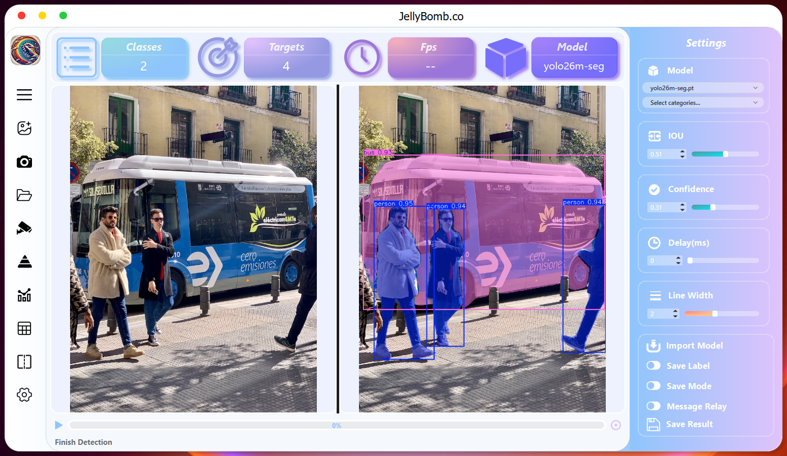

# YoloView - Pyside6 기반 -  YOLOv5 / YOLOv8 / YOLOv9 / YOLOv10 / YOLOv11 / YOLOv12 / YOLOv26 / RTDETR / SAM / MobileSAM / PP-OCR GUI

## 소개

***YoloView***는 Ultralytics 기반의 `YOLOv5` `YOLOv8` `YOLOv9` `YOLOv10` `YOLOv11` `YOLOv12` `YOLOv26` `RT-DETR` `SAM` `MobileSAM` `FastSAM` `PP-OCR` 모델을 지원하는 사용자 인터페이스 (GUI) 애플리케이션 입니다.

<p align="center"> 
  <a href="https://github.com/songminkyu/YOLOSHOW_New/blob/main/README.md"> English</a> &nbsp; | &nbsp; 한국어</a>
 </p>



## 할 일 목록

- [x] `YOLOv5` `YOLOv8` `YOLOv9` `YOLOv10` `YOLO11` `YOLO12` `YOLO26` `RT-DETR` `SAM` `MobileSAM` `FastSAM` `PP-OCR` 모델 추가
- [x] 인스턴스 분할(Instance Segmentation) 지원 （ `YOLOv5`  `YOLOv8`  `YOLOv11` `YOLOv12` `SAM`  `MobileSAM`  `FastSAM`）
- [x] 포즈 추정 지원 （ `YOLOv8 ~ 26` ）
- [x] 지향형 경계 상자 지원 ( `YOLOv8 ~ 26` )
- [x] `RTSP` 함수에서 HTTP 프로토콜 지원 ( `Single` 모드)
- [x] 모델 비교 모드 추가 (VS 모드)
- [x] 파일 입력 드래그 지원
- [x] `YOLO11 ~ 26`에 추가 기능이 있습니다. (obb,pose,deteced,segment,track)
- [x] 추적 및 계산(`YOLOv8 ~ 26`)
- [x] bbox 및 segment 카테고리 필터 기능 추가 (모델 선택 기능 하위 위치)
- [x] 두 파일(`bbox-valid.pt`, `seg-valid.pt`)을 사용하여 Bounding Box와 Segment 라벨 검증 기능 추가.
- [x] 하위 폴더 탐색기능 추가 (폴더 탐색일때만)
- [x] 통계치 개선 및 고도화
- [x] Labal 저장
- [x] Image Navigation Controls 추가 (<<,< ,>, >>)
- [x] 정확성을 위한 큐레이팅(균형 잡힌 컴퓨터 비전 데이터셋 구축) 
- [x] Classes Filter (우측 클래스별 필터 기능 연동)
- [x] 메세지 릴레이 서버 추가
- [ ] glmocr 작업 진행 중

## 함수

### 1. 이미지/비디오/웹캠/폴더(배치)/IPCam 객체 감지 지원

이미지/비디오/웹캠/폴더(배치)/IPCam 선택 왼쪽 메뉴 모음에서 객체를 감지합니다.

### 2. 모델/하이퍼 매개변수를 동적으로 변경

프로그램이 대상을 감지하기 위해 실행 중일 때 모델/하이퍼 매개변수를 변경할 수 있습니다.

1. `YOLOv5` / `YOLOv8` / `YOLOv9` / `RTDETR` / `YOLOv5-seg` / `YOLOv8-seg` / `YOLOv10` / `YOLOv11` / `YOLOv12` / `YOLOv26` 에서 동적으로 모델을 변경하는 것을 지원합니다.
2. `IOU` / `Confidence` / `Delay time` / `line thick`를 동적으로 변경하는 것을 지원합니다.

### 3. 모델을 자동으로 로드합니다.

저희 프로그램은 [YOLOv5 모델](https://github.com/ultralytics/yolov5/releases) / [YOLOv7 모델](https://github.com/WongKinYiu/yolov7/releases/) / [YOLOv8 모델](https://github.com/ultralytics/assets/releases/) / [YOLOv9 모델](https://github.com/WongKinYiu/yolov9/releases/) / [YOLOv10 모델](https://github.com/THU-MIG/yolov10/releases/)은 이전에 `ptfiles` 폴더에 추가되었습니다.

새 `pt` 파일을 추가해야 하는 경우 `설정` 상자에서 `모델 가져오기` 버튼을 클릭하여 `pt` 파일을 선택하세요. 그러면 프로그램에서 `ptfiles` 폴더에 넣습니다.

**알림:**

1. 모든 `pt` 파일에는 `yolov5` / `yolov8` / `yolov9` / `yolov10` / `yolo11` / `yolo12` / `yolo26` / `rtdetr` / `sam` / `samv2` / `mobilesam` / `fastsam`. 등의 이름이 지정됩니다. (예: `yolov8-test.pt`)
2. 분할 모드의 `pt` 파일인 경우 `yolov5n-seg` / `yolov8s-seg`를 포함하여 이름을 지정하세요. (예: `yolov8n-seg-test.pt`)
3. 포즈 추정 모드의 `pt` 파일인 경우 `yolov8n-pose`를 포함하여 이름을 지정하세요. (예: `yolov8n-pose-test.pt`)
4. 지향 바운딩 박스 모드의 `pt` 파일인 경우 `yolov8n-obb`를 포함하여 이름을 지정하세요. (예: `yolov8n-obb-test.pt`)

### 4. 구성 로드

1. 시작 후 프로그램은 자동으로 마지막 구성 매개변수를 로드합니다.
2. 종료 후 프로그램은 변경된 구성 매개변수를 저장합니다.

### 5. 결과 저장

결과를 저장해야 하는 경우 감지하기 전에 `저장 모드`를 클릭하세요. 그러면 선택한 경로에 감지 결과를 저장할 수 있습니다.

### 6. 객체 감지, 인스턴스 분할 및 포즈 추정 지원

***YOLOSHOW v3.0***부터 저희 작업은 객체 감지, 인스턴스 분할, 포즈 추정 및 지향 경계 상자를 모두 지원합니다. 한편, `YOLOv5` 객체 감지 작업에서 `YOLOv8` 인스턴스 분할 작업으로 전환하는 것과 같이 다른 버전 간의 작업 전환도 지원합니다.

### 7. 객체 감지, 인스턴스 분할, 포즈 추정 및 지향 경계 상자 간의 모델 비교 지원

***YOLOSHOW v3.0***부터, 저희 작업은 객체 감지, 인스턴스 분할, 포즈 추정 및 지향 경계 상자 간의 모델 성능을 비교하는 것을 지원합니다.

## 준비

### 실험 환경

```셸
OS: Windows 11
CPU: Intel(R) Core(TM) i7-10750H CPU @2.60GHz 2.59 GHz
GPU: NVIDIA GeForce GTX 1660Ti 6GB
```

### 1. 가상 환경 생성

python 버전 3.11가 장착된 가상 환경을 생성한 다음 환경을 활성화합니다.

```shell
conda create -n yoloview python>=3.12
conda activate yoloview
```

### 2. Pytorch frame 설치 (CUDA)

```shell
Windows: uv pip install torch torchvision torchaudio --index-url https://download.pytorch.org/whl/cu128
Linux: uv pip install torch torchvision torchaudio --index-url https://download.pytorch.org/whl/cu128
```

[](https://pytorch.org/)에서 다른 pytorch 버전 변경

### 3. 종속성 패키지 설치

경로를 프로그램 위치로 전환

```shell
cd {프로그램의 위치 program}
```

프로그램의 종속성 패키지 설치

```shell
uv sync
```

ultralytics 루트 다운로드
```
library_update.bat 실행
```

### 4. Pyside6 Resource 빌드 (절대경로)

리소스 변경이 되었다면 아래 명령어를 실행 해야함. 

```shell
pyside6-rcc {YOLOSHOW_New_Path}\ui\YOLOSHOWUI.qrc -o {YOLOSHOW_New_Path}\ui\YOLOSHOWUI_rc.py
```

Qt widget designer를 통한 편집된 ui 빌드는 아래처럼 실행 해야함.
```shell
pyside6-uic {YOLOSHOW_New_Path}\ui\YOLOSHOWUI.ui -o {YOLOSHOW_New_Path}\ui\YOLOSHOWUI_result.py
```
### 5. 글꼴 추가

#### Windows 사용자

`fonts` 폴더에 있는 모든 글꼴 파일 `*.ttf`를 `C:\Windows\Fonts`로 복사합니다.

#### Linux 사용자

```shell
mkdir -p ~/.local/share/fonts
sudo cp fonts/Shojumaru-Regular.ttf ~/.local/share/fonts/
sudo fc-cache -fv
```

#### MacOS 사용자

MacBook이 너무 비싸서 살 수 없어요. `.ttf`를 직접 설치해 주세요. 😂

### 6. 프로그램 실행

```shell
python main.py
```

### 7. Pyinstaller 

https://github.com/ultralytics/ultralytics/issues/1158
https://github.com/ultralytics/ultralytics/issues/8772

```shell
pyinstaller --onefile --windowed --icon="images/jellybomb.ico" ^
--collect-data=pyiqa ^
--add-data="ultralytics/cfg/default.yaml;ultralytics/cfg" ^
--add-data="ultralytics/cfg/solutions/default.yaml;ultralytics/cfg/solutions" ^
--add-data="ui/YOLOSHOWUI_rc.py;ui" ^
--add-data="fonts;fonts" ^
--add-data="images;images" ^
--add-data="images/newsize;images/newsize" ^
--add-data="models;models" ^
--add-data="ui;ui" ^
--add-data="utils;utils" ^
--add-data="yolocode;yolocode" ^
--add-data="yoloshow;yoloshow" ^
main.py
```
다음으로 그리고 빌드 되면 dist 폴더에 main.exe 하나가 생기는데 상단으로 이동 하여, 
'config', 'ptfiles' 'images' 폴더를 복사해서 dist 폴더 밑에 붙혀넣기 한다. 

    └─dist      (Parent Folder)
    ├─  config  (folder)
    ├─  ptfiles (folder)
    ├─  images  (folder)
    └─  main.exe

 Enjoy YOLO!!

## 프레임

[](https://www.python.org/)[](https://pytorch.org/)[](https://doc.qt.io/qtforpython-6/PySide6/QtWidgets/index.html)[](https://github.com/zhiyiYo/PyQt-Fluent-Widgets)

## 참조

### 데이터셋 다운로드 위치

[Roboflow](https://universe.roboflow.com/browse/)

### YOLO 지원 버전

[YOLOv5](https://github.com/ultralytics/yolov5)  [YOLOv8](https://github.com/ultralytics/ultralytics)  [YOLOv9](https://github.com/ultralytics/ultralytics)  [YOLOv10](https://github.com/ultralytics/ultralytics)  [YOLO11](https://github.com/ultralytics/ultralytics) [YOLO12](https://github.com/ultralytics/ultralytics) [YOLO26](https://github.com/ultralytics/ultralytics)

### YOLO 그래픽 사용자 인터페이스

[YOLOSIDE](https://github.com/Jai-wei/YOLOv8-PySide6-GUI) [PyQt-Fluent-위젯](https://github.com/zhiyiYo/PyQt-Fluent-위젯)
