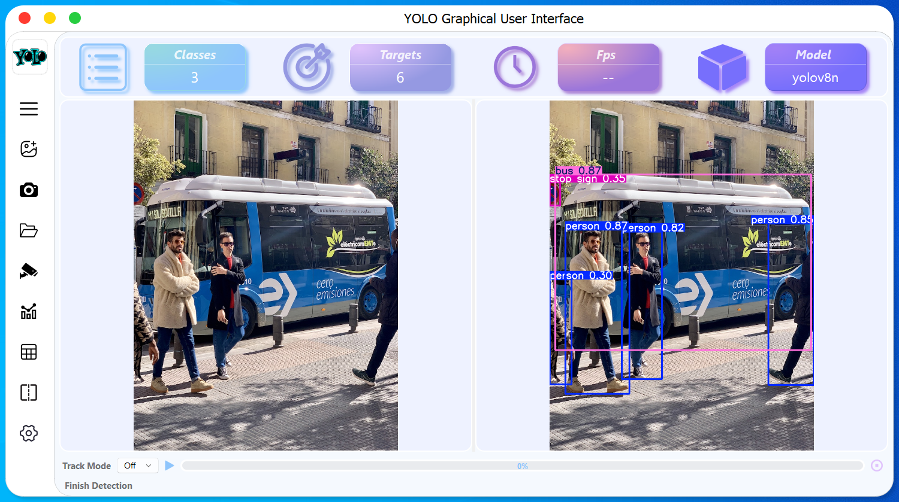

# YOLOSHOW - Pyside6 기반 YOLOv5 / YOLOv7 / YOLOv8 / YOLOv9 / YOLOv10 / RTDETR GUI

## 소개

***YOLOSHOW***는 `YOLOv5` `YOLOv7` `YOLOv8` `YOLOv9` `YOLOv10` `RT-DETR` 알고리즘이 내장된 그래픽 사용자 인터페이스(GUI) 애플리케이션입니다.

<p align="center"> 
  <a href="https://github.com/songminkyu/YOLOSHOW_New/blob/main/README.md"> English</a> &nbsp; | &nbsp; 한국어</a>
 </p>



## 할 일 목록

- [x] `YOLOv9` 알고리즘 추가
- [x] 사용자 인터페이스 조정(메뉴 Bar)
- [x] 완전한 Rtsp 함수
- [x] 인스턴스 분할 지원(`YOLOv5` 및 `YOLOv8`)
- [x] `RT-DETR` 알고리즘 추가(`Ultralytics` repo)
- [x] 모델 비교 모드 추가(VS 모드)
- [x] 포즈 추정 지원(`YOLOv8`)
- [x] Rtsp 함수에서 HTTP 프로토콜 지원(단일 모드)
- [x] 지향형 경계 상자 지원(`YOLOv8`)
- [x] `YOLOv10` 알고리즘 추가
- [x] 드래그 파일 입력 지원
- [x] 추적(Track) 및 계산 (`YOLOv8` 및 `YOLO11`)
- [x] `YOLOv11` 기능 추가 (obb,pose,deteced,segment,track)

## 함수

### 1. 이미지/비디오/웹캠/폴더(배치)/IPCam 객체 감지 지원

이미지/비디오/웹캠/폴더(배치)/IPCam 선택 왼쪽 메뉴 모음에서 객체를 감지합니다.

### 2. 모델/하이퍼 매개변수를 동적으로 변경

프로그램이 대상을 감지하기 위해 실행 중일 때 모델/하이퍼 매개변수를 변경할 수 있습니다.

1. `YOLOv5` / `YOLOv7` / `YOLOv8` / `YOLOv9` / `RTDETR` / `YOLOv5-seg` / `YOLOv8-seg` / `YOLOv10` / `YOLOv11` 에서 동적으로 모델을 변경하는 것을 지원합니다.
2. `IOU` / `Confidence` / `Delay time` / `line thick`를 동적으로 변경하는 것을 지원합니다.

### 3. 모델을 자동으로 로드합니다.

저희 프로그램은 [YOLOv5 모델](https://github.com/ultralytics/yolov5/releases) / [YOLOv7 모델](https://github.com/WongKinYiu/yolov7/releases/) / [YOLOv8 모델](https://github.com/ultralytics/assets/releases/) / [YOLOv9 모델](https://github.com/WongKinYiu/yolov9/releases/) / [YOLOv10 모델](https://github.com/THU-MIG/yolov10/releases/)은 이전에 `ptfiles` 폴더에 추가되었습니다.

새 `pt` 파일을 추가해야 하는 경우 `설정` 상자에서 `모델 가져오기` 버튼을 클릭하여 `pt` 파일을 선택하세요. 그러면 프로그램에서 `ptfiles` 폴더에 넣습니다.

**알림:**

1. 모든 `pt` 파일에는 `yolov5` / `yolov7` / `yolov8` / `yolov9` / `yolov10` / `yolo11` /`rtdetr` 등의 이름이 지정됩니다. (예: `yolov8-test.pt`)
2. 분할 모드의 `pt` 파일인 경우 `yolov5n-seg` / `yolov8s-seg`를 포함하여 이름을 지정하세요. (예: `yolov8n-seg-test.pt`)
3. 포즈 추정 모드의 `pt` 파일인 경우 `yolov8n-pose`를 포함하여 이름을 지정하세요. (예: `yolov8n-pose-test.pt`)
4. 지향 바운딩 박스 모드의 `pt` 파일인 경우 `yolov8n-obb`를 포함하여 이름을 지정하세요. (예: `yolov8n-obb-test.pt`)

### 4. 구성 로드

1. 시작 후 프로그램은 자동으로 마지막 구성 매개변수를 로드합니다.
2. 종료 후 프로그램은 변경된 구성 매개변수를 저장합니다.

### 5. 결과 저장

결과를 저장해야 하는 경우 감지하기 전에 `저장 모드`를 클릭하세요. 그러면 선택한 경로에 감지 결과를 저장할 수 있습니다.

### 6. 객체 감지, 인스턴스 분할 및 포즈 추정 지원

***YOLOSHOW v3.0***부터 저희 작업은 객체 감지, 인스턴스 분할, 포즈 추정 및 지향 경계 상자를 모두 지원합니다. 한편, `YOLOv5` 객체 감지 작업에서 `YOLOv8` 인스턴스 분할 작업으로 전환하는 것과 같이 다른 버전 간의 작업 전환도 지원합니다.

### 7. 객체 감지, 인스턴스 분할, 포즈 추정 및 지향 경계 상자 간의 모델 비교 지원

***YOLOSHOW v3.0***부터, 저희 작업은 객체 감지, 인스턴스 분할, 포즈 추정 및 지향 경계 상자 간의 모델 성능을 비교하는 것을 지원합니다.

## 준비

### 실험 환경

```셸
OS: Windows 11
CPU: Intel(R) Core(TM) i7-10750H CPU @2.60GHz 2.59 GHz
GPU: NVIDIA GeForce GTX 1660Ti 6GB
```

### 1. 가상 환경 생성

python 버전 3.11가 장착된 가상 환경을 생성한 다음 환경을 활성화합니다.

```shell
conda create -n yoloshow python=3.11
conda activate yoloshow
```

### 2. Pytorch frame 설치

```shell
Windows: pip3 install torch torchvision torchaudio --index-url https://download.pytorch.org/whl/cu118
Linux: pip3 install torch torchvision torchaudio --index-url https://download.pytorch.org/whl/cu118
```

[](https://pytorch.org/)에서 다른 pytorch 버전 변경

### 3. 종속성 패키지 설치

경로를 프로그램 위치로 전환

```shell
cd {프로그램의 위치 program}
```

프로그램의 종속성 패키지 설치

```shell
pip install -r requirements.txt -i https://pypi.tuna.tsinghua.edu.cn/simple
```
### 4. Pyside6 Resource 빌드 (절대경로)

리소스 변경이 되었다면 아래 명령어를 실행 해야함. 

```shell
pyside6-rcc {YOLOSHOW_New_Path}\ui\YOLOSHOWUI.qrc -o {YOLOSHOW_New_Path}\ui\YOLOSHOWUI_rc.py
```
### 5. 글꼴 추가

#### Windows 사용자

`fonts` 폴더에 있는 모든 글꼴 파일 `*.ttf`를 `C:\Windows\Fonts`로 복사합니다.

#### Linux 사용자

```shell
mkdir -p ~/.local/share/fonts
sudo cp fonts/Shojumaru-Regular.ttf ~/.local/share/fonts/
sudo fc-cache -fv
```

#### MacOS 사용자

MacBook이 너무 비싸서 살 수 없어요. `.ttf`를 직접 설치해 주세요. 😂

### 6. 프로그램 실행

```shell
python main.py
```

### 7. Pyinstaller 

https://github.com/ultralytics/ultralytics/issues/1158
https://github.com/ultralytics/ultralytics/issues/8772

Python 가상 모듈에서 

shell에 --add-data 2번째줄 작성 방법

ultralytics의 default.yaml 위치한 경로를 명시적으로 선언 하여 패킹 해야함.
그렇치 않으면 실행 하는데 문제가 생김.

* 변경 전


    --add-data="{venv_absolute_path_to}ultralytics/cfg/default.yaml;ultralytics/cfg" ^

* 변경후  (절대 경로 필요)


    ex) --add-data="C:/Users/user/Dev_yolov8/Lib/site-packages/ultralytics/cfg/default.yaml;ultralytics/cfg" ^

```shell

pyinstaller --onefile --windowed ^
--add-data="ui/YOLOSHOWUI_rc.py;ui" ^
--add-data="{venv_path_to}ultralytics/cfg/default.yaml;ultralytics/cfg" ^
--add-data="fonts;fonts" ^
--add-data="images;images" ^
--add-data="models;models" ^
--add-data="ui;ui" ^
--add-data="utils;utils" ^
--add-data="yolocode;yolocode" ^
--add-data="yoloshow;yoloshow" ^
main.py
```
다음으로 그리고 빌드 되면 dist 폴더에 main.exe 하나가 생기는데 상단으로 이동 하여, 
'config', 'fonts' 'images' 'ptfiles' 'runs' 폴더를 복사해서 dist 폴더 밑에 붙혀넣기 한다. 

    └─dist      (Parent Folder)
    ├─  config  (folder)
    ├─  fonts   (folder)
    ├─  images  (folder)
    ├─  ptfiles (folder)
    ├─  runs    (folder)
    └─  main.exe

 Enjoy YOLO!!

## 프레임

[](https://www.python.org/)[](https://pytorch.org/)[](https://doc.qt.io/qtforpython-6/PySide6/QtWidgets/index.html)

## 참조

### YOLO 지원 버전

[YOLOv5](https://github.com/ultralytics/yolov5)  [YOLOv8](https://github.com/ultralytics/ultralytics)  [YOLOv9](https://github.com/ultralytics/ultralytics)  [YOLOv10](https://github.com/ultralytics/ultralytics)  [YOLO11](https://github.com/ultralytics/ultralytics)

### YOLO 그래픽 사용자 인터페이스

[YOLOSIDE](https://github.com/Jai-wei/YOLOv8-PySide6-GUI) [PyQt-Fluent-위젯](https://github.com/zhiyiYo/PyQt-Fluent-위젯)